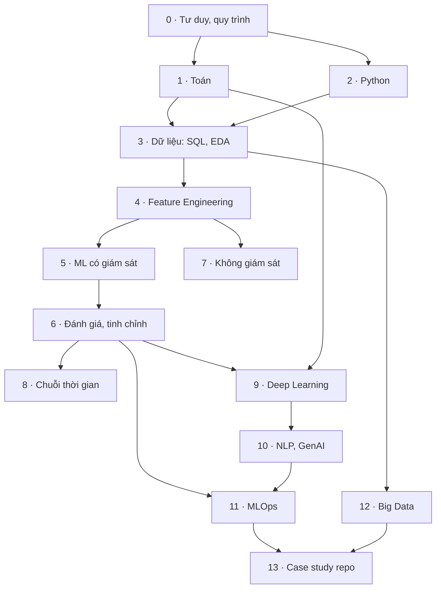

# Full Stack Data Science & Machine Learning BootCamp Course

Repo học tập theo khoá Udemy **Full Stack Data Science & Machine Learning BootCamp**.

**Mục tiêu của bộ tài liệu:** hiểu đủ nền tảng để dùng AI viết code đúng hướng, không mơ hồ. Cụ thể là giao việc cho AI rõ ràng, tự kiểm chứng code AI viết, tự ra quyết định, và phản biện khi AI đề xuất sai. Các nghiên cứu gần đây cho thấy AI chỉ giúp khi người dùng hiểu việc mình đang làm:

- Lập trình viên giàu kinh nghiệm chậm hơn 19% khi dùng AI, dù tin mình nhanh hơn ([METR, 2025](https://metr.org/blog/2025-07-10-early-2025-ai-experienced-os-dev-study/)).
- 66% lập trình viên gặp code AI "gần đúng nhưng chưa hẳn" ([Stack Overflow Survey 2025](https://survey.stackoverflow.co/2025/ai)).
- 19,7% package mà AI đề xuất không tồn tại ([USENIX Security 2025](https://www.helpnetsecurity.com/2025/04/14/package-hallucination-slopsquatting-malicious-code/)).
- Người mới dùng AI để hỏi khái niệm hiểu bài tốt hơn hẳn người giao hết việc viết code cho AI ([Anthropic, 2026](https://www.anthropic.com/research/AI-assistance-coding-skills)).

Repo gồm hai phần:

1. **[Lộ trình Data Science & Machine Learning](roadmap/)**: website tiếng Việt, học từ con số 0 đến triển khai mô hình. Mỗi chủ đề có hướng dẫn làm việc với AI, có theo dõi trạng thái học và xuất PDF.
2. **[Flight Fare Prediction](AI/Flight_Fare_Prediction/)**: dự án dự đoán giá vé máy bay, gồm notebook phân tích, huấn luyện mô hình và web app Flask.

## Bắt đầu nhanh

| Bạn muốn | Mở |
|---|---|
| Chọn nhánh nghề (Data Analyst, Data Engineer, ML Engineer, AI Engineer…) | Mục **Chọn nhánh nghề** trong website, hoặc báo cáo [`reports/Lộ trình các nhánh ngành AI.md`](reports/Lộ%20trình%20các%20nhánh%20ngành%20AI.md) |
| Học cách làm việc với AI và luyện phản biện | Mục **Học để làm chủ AI** trong website, hoặc mục 1 của [`HUONG-DAN-HOC.md`](roadmap/HUONG-DAN-HOC.md) |
| Xem lộ trình học đầy đủ | [`roadmap/index.html`](roadmap/index.html): tải về rồi mở bằng trình duyệt, không cần server |
| Biết nên học gì trước, mỗi tuần học bao nhiêu | [`roadmap/HUONG-DAN-HOC.md`](roadmap/HUONG-DAN-HOC.md) |
| Theo dõi tiến độ ngay trên GitHub | Bảng trạng thái cuối file [`HUONG-DAN-HOC.md`](roadmap/HUONG-DAN-HOC.md) |
| Chạy dự án dự đoán giá vé | Mục [Flight Fare Prediction](#flight-fare-prediction) bên dưới |

## Lộ trình Data Science & Machine Learning

Phần Data Science & ML gồm **14 giai đoạn (0–13), 59 chủ đề, khoảng 585 giờ học**. Mảng Full-stack Web (giai đoạn 14–18, xem [bên dưới](#mảng-full-stack-web-react--remix--prisma)) thêm 23 chủ đề, khoảng 244 giờ. Tổng cộng **19 giai đoạn, 82 chủ đề, khoảng 829 giờ**. Chỉ học phần DS & ML với 10 giờ/tuần thì mất khoảng 59 tuần; 20 giờ/tuần thì khoảng 30 tuần.



| GĐ | Giai đoạn | Thời lượng | Chủ đề | Giờ | Sơ đồ | Case doanh nghiệp |
|---|---|---|---|---|---|---|
| 0 | Tư duy Data Science & quy trình dự án | 1 tuần | 2 | ~7 | 2 | 4 |
| 1 | Nền tảng Toán học | 4–6 tuần | 4 | ~70 | 2 | 8 |
| 2 | Lập trình Python cho dữ liệu | 4–6 tuần | 5 | ~85 | 1 | 9 |
| 3 | Dữ liệu: thu thập, SQL, làm sạch, EDA | 4–5 tuần | 4 | ~67 | 4 | 8 |
| 4 | Feature Engineering | 2–3 tuần | 5 | ~30 | 3 | 9 |
| 5 | Machine Learning có giám sát | 6–8 tuần | 8 | ~54 | 4 | 14 |
| 6 | Đánh giá, tinh chỉnh và giải thích mô hình | 3 tuần | 5 | ~33 | 3 | 8 |
| 7 | Học không giám sát & Hệ gợi ý | 3 tuần | 5 | ~29 | 2 | 10 |
| 8 | Chuỗi thời gian & Dự báo | 2–3 tuần | 2 | ~20 | 1 | 3 |
| 9 | Deep Learning | 6–8 tuần | 4 | ~53 | 3 | 9 |
| 10 | NLP & Generative AI | 5–6 tuần | 5 | ~48 | 5 | 12 |
| 11 | MLOps & Triển khai | 5–6 tuần | 5 | ~42 | 5 | 11 |
| 12 | Big Data & Data Engineering cho DS | 3 tuần | 2 | ~20 | 2 | 3 |
| 13 | Case study: Flight Fare Prediction (repo này) | 1–2 tuần | 3 | ~27 | 3 | 1 |

### Mảng Full-stack Web: React · Remix · Prisma

Năm giai đoạn cho người muốn tự làm sản phẩm web quanh mô hình, hoặc theo nhánh nghề **Full-stack Web**. Có thể bắt đầu ngay sau giai đoạn 2 (Python, Git) và học song song với phần ML. Nội dung cập nhật theo phiên bản 9/2026:

- **Remix đã gộp vào React Router.** Từ 11/2024, Remix v2 trở thành "framework mode" của React Router v7. React Router v8 (6/2026) là bản hiện hành: chỉ hỗ trợ ESM, bật middleware mặc định, bỏ gói `react-router-dom`; Remix v2 và React Router v6 đã hết hỗ trợ. Remix 3 là dự án khác, không dùng React, đang beta. Vì vậy lộ trình dạy loader, action, form, route lồng nhau theo React Router v8.
- **React 19**: Actions, `useActionState`, `useOptimistic`, Server Components; React Compiler 1.0 (10/2025).
- **Prisma ORM 7** (11/2025): bỏ engine Rust, dùng runtime TypeScript, cấu hình trong `prisma.config.ts`.
- **Bảo mật theo OWASP Top 10:2025.**

| GĐ | Giai đoạn | Thời lượng | Chủ đề | Giờ | Sơ đồ | Case doanh nghiệp |
|---|---|---|---|---|---|---|
| 14 | Nền tảng Web: HTTP, HTML/CSS, JavaScript, TypeScript | 4–5 tuần | 4 | ~58 | 1 | 2 |
| 15 | React: component, hook, state, React 19, test | 5–6 tuần | 5 | ~50 | 2 | 1 |
| 16 | Remix / React Router framework: route, loader/action, pending UI, auth, render | 5–6 tuần | 5 | ~44 | 3 | 2 |
| 17 | Prisma và cơ sở dữ liệu cho ứng dụng | 3–4 tuần | 4 | ~32 | 2 | 2 |
| 18 | Full-stack production và tích hợp AI: bảo mật, E2E, deploy, gắn mô hình ML và LLM | 4–5 tuần | 5 | ~60 | 3 | 4 |

Dự án cuối (giai đoạn 18) biến Flight Fare Prediction thành ứng dụng full-stack: giao diện React Router, lưu lịch sử dự đoán bằng Prisma, mô hình chạy sau FastAPI, tất cả chạy bằng docker compose và có CI.

### Mỗi chủ đề có gì

- **Khái niệm**: giải thích bằng tiếng Việt, kèm mức độ (cơ bản, trung cấp, nâng cao) và số giờ ước tính.
- **Sơ đồ Mermaid**: flowchart hoặc sequence diagram cho các bước và các bên tương tác. Tổng cộng 53 sơ đồ.
- **Lý do sử dụng, khi nào dùng, khi nào không nên dùng.**
- **Ví dụ ứng dụng** và **case doanh nghiệp đã công bố**: 120 case của Netflix, Amazon, Airbnb, Uber, Stripe, Booking.com, Morgan Stanley, Grab, MoMo, VinAI… Trong đó có 19 thất bại kèm bài học (Zillow Offers, Google Flu Trends, công cụ tuyển dụng của Amazon, chatbot Air Canada, GitLab xoá nhầm database, Knight Capital deploy lỗi…). Mỗi case có link nguồn.
- **Code mẫu** (Python, SQL, Docker, YAML), **lỗi thường gặp**, **công cụ** và **tài liệu học**.
- **Làm việc với AI**:
  - prompt mẫu cụ thể, có bối cảnh và tiêu chí kiểm tra;
  - dấu hiệu AI đang đề xuất sai;
  - câu hỏi để phản biện AI;
  - cách tự kiểm chứng;
  - những quyết định bạn phải tự đưa ra.

### Tính năng của website

- **Chia tab để khỏi phải cuộn dài:**
  - 8 tab chính: Tổng quan · Làm chủ AI · Nhánh nghề · Học từ đầu · Lộ trình · Chọn thuật toán · Ứng dụng thực tế · Nguồn;
  - tab con trong các mục dài;
  - mỗi chủ đề có 6 tab: Khái niệm · Khi nào dùng · Thực tế · Code và lỗi · Làm việc với AI · Công cụ và tài liệu;
  - tab Lộ trình hiện từng giai đoạn một, có thanh chọn giai đoạn và nút sang giai đoạn trước hoặc tiếp theo;
  - trang nhớ tab và giai đoạn bạn mở lần trước, và link dạng `#m-rag` mở thẳng đúng chủ đề.

- **Chọn nhánh nghề**:
  - bản đồ 11 nhánh chia thành 5 họ (phân tích, hạ tầng, sản phẩm AI, nghiên cứu, phát triển web);
  - chọn theo sở thích, bảng so sánh nhanh;
  - trang chi tiết từng nhánh: câu hỏi cốt lõi, mức toán và kỹ thuật phần mềm cần có, cây kỹ năng, dự án mốc, thứ tự học, công cụ ổn định và công cụ thay đổi nhanh, case có số liệu, bảng phản biện khi AI viết code cho nhánh đó, thị trường Việt Nam;
  - năm khối nền chung cho mọi nhánh, thị trường 2025–2026 (toàn cầu và Việt Nam), vòng phỏng vấn, sơ đồ chuyển nhánh;
  - **lọc lộ trình theo nhánh**: chỉ hiện các chủ đề cốt lõi và nên biết của nhánh đó, kèm tiến độ;
  - **xuất PDF riêng cho từng nhánh**.
- **Học để làm chủ AI**:
  - 6 số liệu nghiên cứu về hiệu quả và rủi ro khi dùng AI viết code;
  - 3 mức hiểu cần đạt ở mỗi chủ đề;
  - sơ đồ quy trình làm việc với AI;
  - 10 câu hỏi kiểm tra mọi đề xuất của AI;
  - những quyết định không giao cho AI;
  - ví dụ prompt mơ hồ và prompt cụ thể;
  - **32 tình huống luyện phản biện**: bạn chọn Chấp nhận, Cần sửa hoặc Bác bỏ rồi xem đáp án, có tính điểm.
- **Hướng dẫn học từ đầu**: sáu bước học, dự án cần làm ở mỗi mốc, và biểu đồ Gantt tự tính lịch theo số giờ học mỗi tuần.
- **Trạng thái học** cho từng chủ đề: Chưa học, Đang học, Đã xong, Cần ôn lại. Trạng thái hiện trên thẻ chủ đề, mục lục, thanh tiến độ và biểu đồ Gantt. Nút đầu trang gợi ý chủ đề nên học tiếp.
- **Chọn thuật toán nhanh**: cây quyết định và bảng tra "nhu cầu → thuật toán".
- **Ứng dụng thực tế theo ngành**: bảng tra 120 case, lọc theo 9 nhóm ngành hoặc chỉ xem thất bại.
- **Tìm kiếm và lọc** theo từ khoá, tên doanh nghiệp, trình độ và trạng thái.
- **Xuất PDF khổ A4**. Có thể xuất toàn bộ lộ trình, từng giai đoạn, từng chủ đề hoặc chỉ các chủ đề chưa xong. File PDF gồm:
  - bìa và mục lục bấm được;
  - kế hoạch học và bảng theo dõi trạng thái;
  - sơ đồ, case doanh nghiệp, code và nguồn.
- **Giao diện sáng/tối**, dùng được trên điện thoại.

Trạng thái học lưu trong trình duyệt khi mở file `index.html`. Khi mở bản đăng trên Claude, trạng thái lưu theo tài khoản và đồng bộ giữa các thiết bị. Website cần kết nối mạng để tải font, thư viện vẽ sơ đồ (Mermaid) và thư viện tạo PDF từ CDN.

### Cấu trúc thư mục `roadmap/`

```
roadmap/
├── index.html              # website đã build, mở trực tiếp bằng trình duyệt
├── HUONG-DAN-HOC.md        # hướng dẫn học + bảng theo dõi trạng thái trên GitHub
├── build.py                # ghép src/ thành index.html
├── gen_guide.js            # sinh HUONG-DAN-HOC.md từ dữ liệu
└── src/
    ├── data-1-foundations.js   # GĐ 0–3: tư duy, toán, Python, dữ liệu
    ├── data-2-ml.js            # GĐ 4–7: feature engineering, ML, đánh giá, không giám sát
    ├── data-3-dl.js            # GĐ 8–10: chuỗi thời gian, deep learning, NLP & GenAI
    ├── data-4-mlops.js         # GĐ 11–13: MLOps, big data, case study
    ├── data-5-diagrams.js      # sơ đồ tổng quan, cây chọn thuật toán, sơ đồ theo chủ đề
    ├── data-6-applications.js  # case doanh nghiệp có nguồn
    ├── data-7-ai.js            # làm việc với AI cho từng chủ đề, tình huống phản biện, số liệu nghiên cứu
    ├── data-8-branches.js      # 10 nhánh nghề AI và dữ liệu, khối nền chung, thị trường, phỏng vấn, chuyển nhánh
    ├── data-9-fullstack.js     # GĐ 14–18: Web, React, React Router (Remix), Prisma, production; nhánh Full-stack
    ├── template.html, styles.css, app.js
```

Sửa nội dung trong `roadmap/src/`, sau đó build lại:

```bash
python roadmap/build.py              # tạo lại roadmap/index.html
node roadmap/gen_guide.js --force    # tạo lại HUONG-DAN-HOC.md (xoá trạng thái bạn đã đánh trong file)
```

## Flight Fare Prediction

Dự án dự đoán giá vé máy bay nội địa Ấn Độ năm 2019 (thư mục [`AI/Flight_Fare_Prediction/`](AI/Flight_Fare_Prediction/)).

| File | Nội dung |
|---|---|
| `Data_Train.xlsx`, `Test_set.xlsx` | 10.683 chuyến bay có giá (tập train) và 2.671 chuyến không có giá (tập test) |
| `flight_price.ipynb` | EDA, tạo đặc trưng ngày giờ, one-hot hãng bay và tuyến, Random Forest, RandomizedSearchCV |
| `flight_rf.pkl` | Mô hình Random Forest đã huấn luyện |
| `app.py`, `templates/home.html` | Web app Flask nhận form và trả giá dự đoán |

Kết quả trong notebook: **R² = 0,798** trên tập test, **MAE ≈ 1.174 rupee** (khoảng 14% giá vé trung vị), RMSE ≈ 2.085.

### Chạy web app

```bash
cd AI/Flight_Fare_Prediction
python -m venv .venv && source .venv/bin/activate     # Windows: .venv\Scripts\activate
pip install flask flask-cors pandas scikit-learn openpyxl
python app.py                                           # mở http://127.0.0.1:5000
```

`app.py` đang load mô hình từ đường dẫn tuyệt đối `D:/...`. Trước khi chạy, sửa dòng đó thành:

```python
from pathlib import Path
model = pickle.load(open(Path(__file__).parent / "flight_rf.pkl", "rb"))
```

File `.pkl` phụ thuộc phiên bản scikit-learn đã dùng để lưu. Nếu gặp lỗi khi load, chạy lại notebook để huấn luyện và lưu lại mô hình.

### Các vấn đề đã biết

Các điểm này được phân tích chi tiết trong giai đoạn 13 của lộ trình:

- Thời lượng bay tính bằng `abs(Arrival_hour - Dep_hour)` nên sai với chuyến qua nửa đêm (22:20 → 01:10 bị tính thành 21 giờ 10 phút).
- Mã hoá one-hot trong `app.py` viết tay bằng chuỗi if/elif dài, dễ lệch với lúc huấn luyện. Nên dùng `Pipeline` + `OneHotEncoder`.
- Notebook lưu `reg_rf` (mô hình mặc định) chứ không lưu mô hình đã tinh chỉnh `rf_random.best_estimator_`.
- `max_features='auto'` và `sns.distplot` đã bị loại bỏ trong các phiên bản thư viện mới.
- Chỉ chia train/test ngẫu nhiên, chưa kiểm tra theo thời gian.

## Báo cáo nghiên cứu

- [`reports/Lộ trình các nhánh ngành AI.md`](reports/Lộ%20trình%20các%20nhánh%20ngành%20AI.md): báo cáo khoảng 13.900 từ, có nguồn cho từng số liệu. Nội dung gồm 10 nhánh nghề AI và dữ liệu, nền chung, những điều cần phản biện khi AI viết code, thị trường toàn cầu và Việt Nam 2025–2026, cách chọn và chuyển nhánh.
- Ghi chú nghiên cứu gốc cho từng nhánh nằm trong `research_notes/Lộ trình các nhánh ngành AI/`.

## Nguồn tham khảo chính

- [An Introduction to Statistical Learning](https://www.statlearning.com/)
- [Forecasting: Principles and Practice](https://otexts.com/fpp3/)
- [Dive into Deep Learning](https://d2l.ai/)
- [Google — Rules of Machine Learning](https://developers.google.com/machine-learning/guides/rules-of-ml)
- [Booking.com — 150 Successful Machine Learning Models (KDD 2019)](https://dl.acm.org/doi/10.1145/3292500.3330744)
- [The Netflix Recommender System](https://dl.acm.org/doi/10.1145/2843948)

Danh sách đầy đủ nằm trong website, ở mục **Nguồn tham khảo** và trong từng chủ đề.
