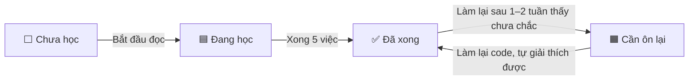
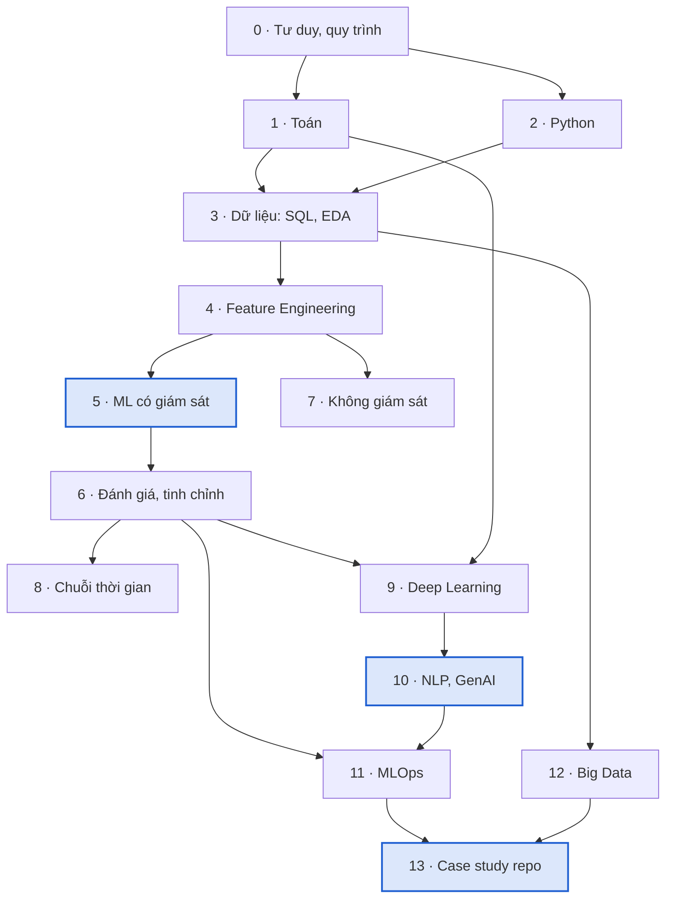
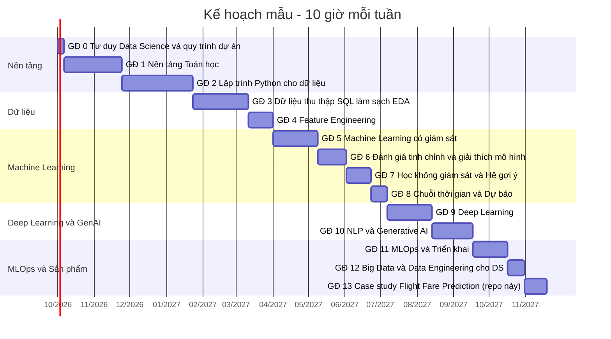

# Hướng dẫn học Data Science & Machine Learning từ đầu

Tài liệu này đi kèm website [roadmap/index.html](index.html). Website có đầy đủ nội dung từng chủ đề, sơ đồ,
code mẫu, ô chọn trạng thái và xuất PDF. File này dùng để theo dõi tiến độ ngay trên GitHub: sửa cột **Trạng thái**
trong bảng cuối file rồi commit.

Tổng cộng **14 giai đoạn, 59 chủ đề, khoảng 585 giờ học**.
Với 10 giờ/tuần là khoảng 59 tuần; 20 giờ/tuần là khoảng 30 tuần.

## 1. Sáu bước học từ con số 0

1. **Kiểm tra đầu vào.** Cần dùng được máy tính, cài được phần mềm, đọc được tài liệu tiếng Anh kỹ thuật cơ bản
   và nhớ toán phổ thông. Nếu đã biết một phần, làm lại code mẫu của chủ đề đó mà không nhìn: làm được thì đánh
   "Đã xong", chưa chắc thì đánh "Cần ôn lại".
2. **Đặt nhịp học.** Người đi làm nên giữ 8–12 giờ/tuần; học toàn thời gian 25–35 giờ/tuần. Trên website, nhập số
   giờ mỗi tuần và ngày bắt đầu để biểu đồ Gantt tự tính lịch.
3. **Học theo thứ tự giai đoạn.** Giai đoạn 0 → 6 là phần lõi bắt buộc. Sau đó chọn nhánh: dữ liệu bảng và dự báo
   (7, 8), AI và LLM (9, 10), hoặc triển khai (11, 12). Giai đoạn 13 áp dụng tất cả vào dự án của repo.
4. **Mỗi chủ đề đi qua năm việc:** đọc khái niệm → xem sơ đồ và tự vẽ lại → chạy code mẫu (Jupyter/Colab) →
   làm lại với bộ dữ liệu khác trên Kaggle → tự giải thích dùng khi nào, không dùng khi nào, vì sao.
5. **Làm dự án ở mỗi mốc** (bảng ở mục 4) trước khi đi tiếp.
6. **Ôn định kỳ.** Cuối tuần lọc "Cần ôn lại" để làm lại; cuối tháng xuất PDF "Chủ đề chưa xong" để in và ghi chú.

## 2. Bốn trạng thái và khi nào đổi

| Ký hiệu | Trạng thái | Khi nào dùng |
|---|---|---|
| ⬜ | Chưa học | Chưa mở chủ đề này. |
| 🟦 | Đang học | Đang đọc, xem sơ đồ, chạy code hoặc làm bài tập. |
| ✅ | Đã xong | Giải thích được khái niệm, đã chạy code và tự làm lại với dữ liệu khác. |
| 🟧 | Cần ôn lại | Đã học nhưng làm lại sau 1–2 tuần thì chưa chắc. |

Vòng đời thường gặp của một chủ đề:

## 3. Lộ trình và lịch mẫu

Thứ tự và phụ thuộc giữa các giai đoạn:

Lịch mẫu với 10 giờ/tuần, bắt đầu 01/10/2026 (trên website lịch tự tính theo số giờ của bạn và tô màu theo trạng thái):

## 4. Dự án ở các mốc

| Sau giai đoạn | Dự án | Chứng minh được |
|---|---|---|
| 3. Dữ liệu | Phân tích EDA bộ `AI/Flight_Fare_Prediction/Data_Train.xlsx`, báo cáo một trang về yếu tố ảnh hưởng giá vé | pandas, SQL, trực quan hoá |
| 6. Đánh giá | Mô hình dự đoán giá vé: Pipeline, chia theo thời gian, so sánh baseline, Ridge, Random Forest, LightGBM | Feature engineering, validation, tuning |
| 7. Không giám sát | Phân khúc khách hàng RFM với bộ Online Retail (UCI) | K-Means, diễn giải cụm |
| 8. Chuỗi thời gian | Dự báo doanh số 8 tuần, so với seasonal naive bằng backtesting | Lag features, đánh giá theo thời gian |
| 10. NLP và GenAI | Chatbot RAG hỏi đáp tài liệu khoá học, có trích dẫn và 30 câu hỏi đánh giá | Embeddings, vector search, đánh giá LLM |
| 11 → 13. MLOps | Flight Fare lên FastAPI + Docker, CI bằng GitHub Actions, báo cáo drift | Triển khai, MLflow, giám sát |

## 5. Bảng theo dõi trạng thái

Đổi ký hiệu ở cột **Trạng thái** (⬜ 🟦 ✅ 🟧) và ghi ngày khi bạn đổi.

### Giai đoạn 0. Tư duy Data Science & quy trình dự án

Biết mình đang giải bài toán gì trước khi viết dòng code đầu tiên. Thời lượng 1 tuần, khoảng 7 giờ. Mục tiêu: Chuyển một câu hỏi kinh doanh thành bài toán dữ liệu đo lường được, và biết vòng đời của một dự án ML.

| # | Chủ đề | Trình độ | Giờ | Trạng thái | Ngày | Ghi chú |
|---|---|---|---|---|---|---|
| 0.1 | Quy trình CRISP-DM và vòng đời dự án ML | Cơ bản | 4 | ⬜ Chưa học |  |  |
| 0.2 | Đóng khung bài toán (Problem framing) | Cơ bản | 3 | ⬜ Chưa học |  |  |

### Giai đoạn 1. Nền tảng Toán học

Đủ toán để hiểu mô hình làm gì, không cần chứng minh định lý. Thời lượng 4–6 tuần, khoảng 70 giờ. Mục tiêu: Đọc được công thức trong tài liệu ML, hiểu gradient descent, phân phối xác suất và kiểm định thống kê.

| # | Chủ đề | Trình độ | Giờ | Trạng thái | Ngày | Ghi chú |
|---|---|---|---|---|---|---|
| 1.1 | Đại số tuyến tính | Cơ bản | 20 | ⬜ Chưa học |  |  |
| 1.2 | Giải tích & Tối ưu hoá | Trung cấp | 15 | ⬜ Chưa học |  |  |
| 1.3 | Xác suất | Cơ bản | 15 | ⬜ Chưa học |  |  |
| 1.4 | Thống kê suy luận & A/B testing | Trung cấp | 20 | ⬜ Chưa học |  |  |

### Giai đoạn 2. Lập trình Python cho dữ liệu

Công cụ làm việc hằng ngày của mọi Data Scientist. Thời lượng 4–6 tuần, khoảng 85 giờ. Mục tiêu: Viết code Python sạch, xử lý bảng dữ liệu bằng Pandas, tính toán bằng NumPy, vẽ biểu đồ, quản lý môi trường và Git.

| # | Chủ đề | Trình độ | Giờ | Trạng thái | Ngày | Ghi chú |
|---|---|---|---|---|---|---|
| 2.1 | Python cốt lõi | Cơ bản | 30 | ⬜ Chưa học |  |  |
| 2.2 | NumPy | Cơ bản | 10 | ⬜ Chưa học |  |  |
| 2.3 | Pandas (và Polars) | Cơ bản | 25 | ⬜ Chưa học |  |  |
| 2.4 | Trực quan hoá dữ liệu | Cơ bản | 12 | ⬜ Chưa học |  |  |
| 2.5 | Git, môi trường và code tái lập | Cơ bản | 8 | ⬜ Chưa học |  |  |

### Giai đoạn 3. Dữ liệu: thu thập, SQL, làm sạch, EDA

Mô hình chỉ tốt bằng dữ liệu đưa vào. Thời lượng 4–5 tuần, khoảng 67 giờ. Mục tiêu: Lấy dữ liệu từ database, API, web; làm sạch và khám phá để hiểu cấu trúc và vấn đề của dữ liệu.

| # | Chủ đề | Trình độ | Giờ | Trạng thái | Ngày | Ghi chú |
|---|---|---|---|---|---|---|
| 3.1 | SQL | Cơ bản | 25 | ⬜ Chưa học |  |  |
| 3.2 | Thu thập dữ liệu: API, web scraping, file | Trung cấp | 12 | ⬜ Chưa học |  |  |
| 3.3 | Làm sạch dữ liệu | Cơ bản | 15 | ⬜ Chưa học |  |  |
| 3.4 | Phân tích khám phá (EDA) | Cơ bản | 15 | ⬜ Chưa học |  |  |

### Giai đoạn 4. Feature Engineering

Biến dữ liệu thô thành tín hiệu mô hình học được. Thời lượng 2–3 tuần, khoảng 30 giờ. Mục tiêu: Mã hoá biến phân loại, chuẩn hoá, tạo đặc trưng thời gian, chọn đặc trưng, xử lý mất cân bằng, và gói tất cả vào Pipeline.

| # | Chủ đề | Trình độ | Giờ | Trạng thái | Ngày | Ghi chú |
|---|---|---|---|---|---|---|
| 4.1 | Mã hoá biến phân loại | Cơ bản | 6 | ⬜ Chưa học |  |  |
| 4.2 | Chuẩn hoá, biến đổi và đặc trưng mới | Cơ bản | 8 | ⬜ Chưa học |  |  |
| 4.3 | Lựa chọn đặc trưng | Trung cấp | 6 | ⬜ Chưa học |  |  |
| 4.4 | Dữ liệu mất cân bằng | Trung cấp | 5 | ⬜ Chưa học |  |  |
| 4.5 | Pipeline trong scikit-learn | Trung cấp | 5 | ⬜ Chưa học |  |  |

### Giai đoạn 5. Machine Learning có giám sát

Học từ dữ liệu có nhãn để dự đoán số hoặc lớp. Thời lượng 6–8 tuần, khoảng 54 giờ. Mục tiêu: Hiểu trực giác, giả định, ưu nhược điểm và trường hợp áp dụng của các thuật toán cốt lõi; biết chọn thuật toán cho bài toán cụ thể.

| # | Chủ đề | Trình độ | Giờ | Trạng thái | Ngày | Ghi chú |
|---|---|---|---|---|---|---|
| 5.1 | Hồi quy tuyến tính, Ridge, Lasso, ElasticNet | Cơ bản | 10 | ⬜ Chưa học |  |  |
| 5.2 | Hồi quy Logistic | Cơ bản | 8 | ⬜ Chưa học |  |  |
| 5.3 | K-Nearest Neighbors (KNN) | Cơ bản | 4 | ⬜ Chưa học |  |  |
| 5.4 | Cây quyết định | Cơ bản | 6 | ⬜ Chưa học |  |  |
| 5.5 | Random Forest | Cơ bản | 6 | ⬜ Chưa học |  |  |
| 5.6 | Gradient Boosting: XGBoost, LightGBM, CatBoost | Trung cấp | 12 | ⬜ Chưa học |  |  |
| 5.7 | Support Vector Machine (SVM) | Trung cấp | 5 | ⬜ Chưa học |  |  |
| 5.8 | Naive Bayes | Cơ bản | 3 | ⬜ Chưa học |  |  |

### Giai đoạn 6. Đánh giá, tinh chỉnh và giải thích mô hình

Biết mô hình tốt đến đâu, vì sao, và có tin được không. Thời lượng 3 tuần, khoảng 33 giờ. Mục tiêu: Chọn metric đúng, validation đúng cách, tránh rò rỉ, tinh chỉnh siêu tham số và giải thích dự đoán.

| # | Chủ đề | Trình độ | Giờ | Trạng thái | Ngày | Ghi chú |
|---|---|---|---|---|---|---|
| 6.1 | Metric cho hồi quy và phân loại | Cơ bản | 8 | ⬜ Chưa học |  |  |
| 6.2 | Train/validation/test, Cross-validation và Data leakage | Trung cấp | 8 | ⬜ Chưa học |  |  |
| 6.3 | Bias–Variance, Overfitting và Regularization | Trung cấp | 5 | ⬜ Chưa học |  |  |
| 6.4 | Tinh chỉnh siêu tham số | Trung cấp | 6 | ⬜ Chưa học |  |  |
| 6.5 | Giải thích mô hình (XAI): SHAP, PDP | Nâng cao | 6 | ⬜ Chưa học |  |  |

### Giai đoạn 7. Học không giám sát & Hệ gợi ý

Tìm cấu trúc trong dữ liệu không có nhãn. Thời lượng 3 tuần, khoảng 29 giờ. Mục tiêu: Phân cụm, giảm chiều, phát hiện bất thường và xây dựng hệ gợi ý cơ bản.

| # | Chủ đề | Trình độ | Giờ | Trạng thái | Ngày | Ghi chú |
|---|---|---|---|---|---|---|
| 7.1 | Phân cụm K-Means | Cơ bản | 5 | ⬜ Chưa học |  |  |
| 7.2 | Phân cụm theo mật độ và phân cấp (DBSCAN, HDBSCAN, Hierarchical) | Trung cấp | 4 | ⬜ Chưa học |  |  |
| 7.3 | Giảm chiều: PCA, t-SNE, UMAP | Trung cấp | 5 | ⬜ Chưa học |  |  |
| 7.4 | Phát hiện bất thường | Trung cấp | 5 | ⬜ Chưa học |  |  |
| 7.5 | Hệ gợi ý (Recommender Systems) | Nâng cao | 10 | ⬜ Chưa học |  |  |

### Giai đoạn 8. Chuỗi thời gian & Dự báo

Dự đoán tương lai từ dữ liệu có thứ tự thời gian. Thời lượng 2–3 tuần, khoảng 20 giờ. Mục tiêu: Phân rã chuỗi, xây baseline, dùng mô hình thống kê và ML cho dự báo, đánh giá đúng theo thời gian.

| # | Chủ đề | Trình độ | Giờ | Trạng thái | Ngày | Ghi chú |
|---|---|---|---|---|---|---|
| 8.1 | Thành phần chuỗi thời gian và mô hình thống kê | Trung cấp | 10 | ⬜ Chưa học |  |  |
| 8.2 | Dự báo bằng Machine Learning và Deep Learning | Nâng cao | 10 | ⬜ Chưa học |  |  |

### Giai đoạn 9. Deep Learning

Mạng nơ-ron cho ảnh, chuỗi và dữ liệu phi cấu trúc. Thời lượng 6–8 tuần, khoảng 53 giờ. Mục tiêu: Xây, huấn luyện và tinh chỉnh mạng nơ-ron bằng PyTorch; hiểu CNN, RNN và Transformer; dùng transfer learning.

| # | Chủ đề | Trình độ | Giờ | Trạng thái | Ngày | Ghi chú |
|---|---|---|---|---|---|---|
| 9.1 | Mạng nơ-ron cơ bản & PyTorch | Trung cấp | 20 | ⬜ Chưa học |  |  |
| 9.2 | Thị giác máy tính: CNN và Vision Transformer | Nâng cao | 15 | ⬜ Chưa học |  |  |
| 9.3 | Mô hình chuỗi: RNN, LSTM, GRU | Nâng cao | 6 | ⬜ Chưa học |  |  |
| 9.4 | Transformer và Attention | Nâng cao | 12 | ⬜ Chưa học |  |  |

### Giai đoạn 10. NLP & Generative AI

Xây ứng dụng trên mô hình ngôn ngữ lớn. Thời lượng 5–6 tuần, khoảng 48 giờ. Mục tiêu: Hiểu embeddings, dùng LLM qua API, xây RAG, biết khi nào fine-tune, xây agent và đánh giá hệ thống LLM.

| # | Chủ đề | Trình độ | Giờ | Trạng thái | Ngày | Ghi chú |
|---|---|---|---|---|---|---|
| 10.1 | Tiền xử lý văn bản và Embeddings | Trung cấp | 8 | ⬜ Chưa học |  |  |
| 10.2 | LLM và Prompt Engineering | Trung cấp | 8 | ⬜ Chưa học |  |  |
| 10.3 | RAG: Retrieval-Augmented Generation | Nâng cao | 12 | ⬜ Chưa học |  |  |
| 10.4 | Fine-tuning LLM (LoRA, QLoRA) | Nâng cao | 10 | ⬜ Chưa học |  |  |
| 10.5 | AI Agents và đánh giá hệ thống LLM | Nâng cao | 10 | ⬜ Chưa học |  |  |

### Giai đoạn 11. MLOps & Triển khai

Đưa mô hình từ notebook vào sản phẩm và giữ nó hoạt động tốt. Thời lượng 5–6 tuần, khoảng 42 giờ. Mục tiêu: Đóng gói mô hình thành API, container hoá, theo dõi thí nghiệm, tự động hoá pipeline, giám sát drift và huấn luyện lại.

| # | Chủ đề | Trình độ | Giờ | Trạng thái | Ngày | Ghi chú |
|---|---|---|---|---|---|---|
| 11.1 | Phục vụ mô hình qua API: Flask, FastAPI | Trung cấp | 10 | ⬜ Chưa học |  |  |
| 11.2 | Docker và triển khai lên cloud | Trung cấp | 10 | ⬜ Chưa học |  |  |
| 11.3 | Theo dõi thí nghiệm & Model Registry | Trung cấp | 6 | ⬜ Chưa học |  |  |
| 11.4 | Pipeline tự động, CI/CD và Feature Store | Nâng cao | 10 | ⬜ Chưa học |  |  |
| 11.5 | Giám sát mô hình: Data drift, Concept drift | Nâng cao | 6 | ⬜ Chưa học |  |  |

### Giai đoạn 12. Big Data & Data Engineering cho DS

Khi dữ liệu không còn vừa một máy. Thời lượng 3 tuần, khoảng 20 giờ. Mục tiêu: Xử lý dữ liệu lớn bằng Spark và DuckDB, hiểu kiến trúc kho dữ liệu và lakehouse, viết pipeline ETL/ELT cơ bản.

| # | Chủ đề | Trình độ | Giờ | Trạng thái | Ngày | Ghi chú |
|---|---|---|---|---|---|---|
| 12.1 | Apache Spark (PySpark) và DuckDB | Nâng cao | 12 | ⬜ Chưa học |  |  |
| 12.2 | Kho dữ liệu, Lakehouse và ETL/ELT | Trung cấp | 8 | ⬜ Chưa học |  |  |

### Giai đoạn 13. Case study: Flight Fare Prediction (repo này)

Áp dụng toàn bộ roadmap vào dự án có sẵn trong AI/Flight_Fare_Prediction. Thời lượng 1–2 tuần, khoảng 27 giờ. Mục tiêu: Đọc hiểu dự án hiện tại, xác định các điểm cần cải thiện, và nâng cấp thành một dự án portfolio đạt chuẩn sản phẩm.

| # | Chủ đề | Trình độ | Giờ | Trạng thái | Ngày | Ghi chú |
|---|---|---|---|---|---|---|
| 13.1 | Dự án hiện tại làm gì | Cơ bản | 3 | ⬜ Chưa học |  |  |
| 13.2 | Các vấn đề phát hiện được và cách sửa | Trung cấp | 4 | ⬜ Chưa học |  |  |
| 13.3 | Lộ trình nâng cấp thành dự án portfolio | Nâng cao | 20 | ⬜ Chưa học |  |  |
