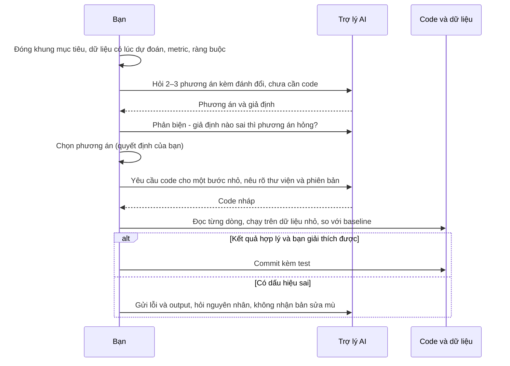
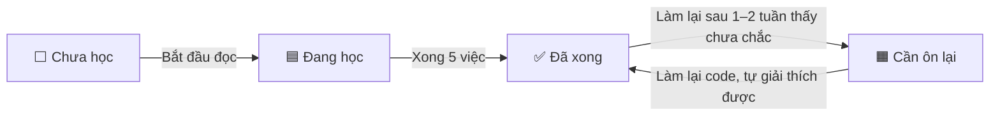
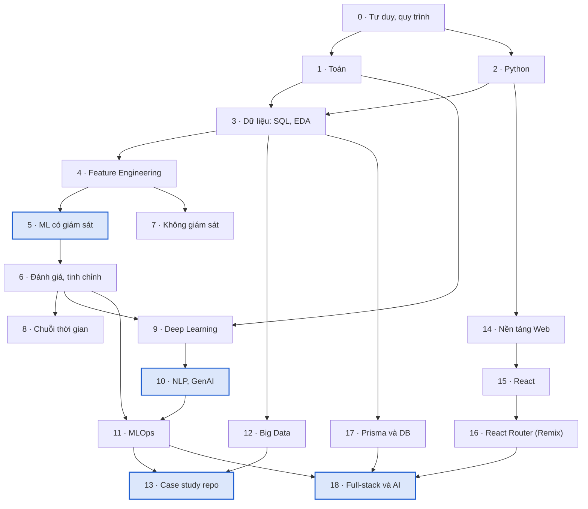
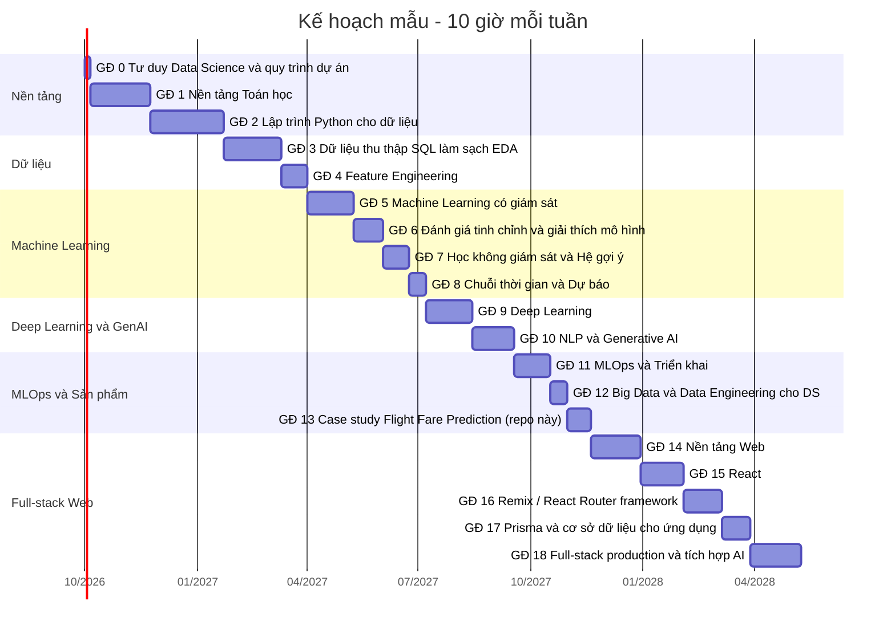

# Hướng dẫn học Data Science & Machine Learning từ đầu

Tài liệu này đi kèm website [roadmap/index.html](index.html). Website có đầy đủ nội dung từng chủ đề, sơ đồ,
code mẫu, ô chọn trạng thái và xuất PDF. File này dùng để theo dõi tiến độ ngay trên GitHub: sửa cột **Trạng thái**
trong bảng cuối file rồi commit.

Tổng cộng **19 giai đoạn, 82 chủ đề, khoảng 829 giờ học**.
Với 10 giờ/tuần là khoảng 83 tuần; 20 giờ/tuần là khoảng 42 tuần.

## 1. Mục tiêu: hiểu đủ để làm chủ AI

Bộ tài liệu này giúp bạn hiểu đủ nền tảng để **giao việc cho AI rõ ràng, tự kiểm chứng code AI viết,
ra quyết định và phản biện được đề xuất của AI**. Các nghiên cứu cho thấy AI chỉ giúp khi người dùng hiểu việc mình làm:

- **−19%**: Lập trình viên giàu kinh nghiệm chậm hơn 19% khi dùng AI trên dự án quen thuộc, dù chính họ tin mình nhanh hơn khoảng 20%. ([METR, 2025 — thử nghiệm ngẫu nhiên, 16 lập trình viên, 246 task](https://metr.org/blog/2025-07-10-early-2025-ai-experienced-os-dev-study/))
- **+55,8%**: Với một task mới, được mô tả rõ (viết HTTP server), nhóm dùng Copilot hoàn thành nhanh hơn 55,8%. ([GitHub Copilot controlled experiment (arXiv 2302.06590)](https://arxiv.org/abs/2302.06590))
- **66%**: Lập trình viên nói nỗi khó chịu lớn nhất là code AI viết 'gần đúng nhưng chưa hẳn'. 46% không tin độ chính xác của AI, chỉ 3% tin cao. ([Stack Overflow Developer Survey 2025](https://survey.stackoverflow.co/2025/ai))
- **19,7%**: Trong 576.000 mẫu code của 16 mô hình, 19,7% package được đề xuất không tồn tại; 43% tên bịa lặp lại khi hỏi lại, nên kẻ xấu có thể đăng ký trước. ([Spracklen et al. — We Have a Package for You! (USENIX Security 2025)](https://www.helpnetsecurity.com/2025/04/14/package-hallucination-slopsquatting-malicious-code/))
- **45%**: Code do hơn 100 mô hình sinh ra cho 80 task thực tế có lỗ hổng bảo mật OWASP Top 10 trong 45% trường hợp. ([Veracode — 2025 GenAI Code Security Report](https://www.veracode.com/blog/genai-code-security-report/))
- **65% vs <40%**: Người mới học thư viện mới: nhóm dùng AI để hỏi khái niệm đạt từ 65% trở lên trong bài kiểm tra hiểu biết, nhóm giao hết việc viết code cho AI dưới 40%. Khoảng cách lớn nhất nằm ở kỹ năng debug. ([Anthropic — How AI assistance impacts the formation of coding skills (2026)](https://www.anthropic.com/research/AI-assistance-coding-skills))

**Ba mức hiểu cần đạt ở mỗi chủ đề**

1. **Đọc hiểu:** giải thích được từng dòng code AI viết.
2. **Nhận diện lỗi:** biết lỗi AI hay mắc ở chủ đề đó (rò rỉ dữ liệu, chia tập sai, metric sai, tham số đã bị loại bỏ, package không tồn tại).
3. **Quyết định:** chọn phương án dựa trên đánh đổi và nói được vì sao không chọn phương án khác.

**Quy trình làm việc với AI**

**10 câu hỏi kiểm tra mọi đề xuất của AI**

1. Đặc trưng này có sẵn tại thời điểm dự đoán không?
2. Bước nào đang fit trên dữ liệu, có chạm vào tập test không?
3. Cách chia tập có khớp cách mô hình được dùng (theo thời gian, theo nhóm) không?
4. Metric có gắn với chi phí thật của sai số không, đã so với baseline chưa?
5. Hàm và tham số có tồn tại trong phiên bản thư viện đang dùng không? Đối chiếu tài liệu chính thức.
6. Package được đề xuất có thật trên PyPI không, ai phát triển, bao nhiêu lượt tải?
7. Kết quả có tốt đến mức đáng ngờ không (accuracy 99%, R² 0,99)?
8. Có giả định ngầm nào về phân phối, đơn vị, tính độc lập của dữ liệu không?
9. Code có chạy được trên máy khác không (đường dẫn, secret, phiên bản)?
10. Tôi có tự giải thích được từng dòng không? Nếu không, hỏi AI giải thích trước khi dùng.

**Quyết định không giao cho AI:** mục tiêu, target và metric chính; ngưỡng quyết định theo chi phí thật; dữ liệu nào được phép dùng
(pháp lý, quyền riêng tư, công bằng); mức rủi ro khi triển khai và khi nào dừng mô hình; hành động không thể hoàn tác.

**Prompt mơ hồ và prompt cụ thể**

| Mơ hồ | Cụ thể |
|---|---|
| Viết code dự đoán giá vé cho tôi. | Dữ liệu Data_Train.xlsx, target Price, dự đoán lúc người dùng tìm vé. Dùng scikit-learn 1.5, Pipeline + ColumnTransformer, chia theo thời gian (train tháng 3–5, test tháng 6), so với baseline trung vị theo tuyến, báo cáo MAE. Làm từng bước và giải thích lý do. |
| Làm sao cải thiện mô hình? | R² train 0,95, test 0,80, MAE 1.174. Liệt kê 3 giả thuyết theo thứ tự khả năng, mỗi giả thuyết kèm cách kiểm chứng tốn ít thời gian nhất. Chưa viết code. |

**Luyện phản biện:** tự đánh giá mỗi đề xuất là *Chấp nhận*, *Cần sửa* hay *Bác bỏ*, rồi mới mở đáp án.

1. AI đề xuất: Để xử lý giá trị thiếu, tôi điền trung bình cho toàn bộ DataFrame rồi mới chia train/test. `df = df.fillna(df.mean()); X_train, X_test, y_train, y_test = train_test_split(X, y)`
   

Đáp án
Cần sửa. Trung bình được tính cả trên tập test, nên thông tin của test lọt vào lúc huấn luyện (rò rỉ). Chia tập trước, dùng SimpleImputer trong Pipeline để chỉ fit trên train.

2. AI đề xuất: Mô hình phát hiện gian lận đạt accuracy 99,8%, rất tốt, có thể triển khai.
   

Đáp án
Bác bỏ. Gian lận chỉ chiếm 0,2%: dự đoán 'không gian lận' cho mọi giao dịch cũng đạt 99,8%. Cần precision, recall, PR-AUC và so với baseline.

3. AI đề xuất: Dữ liệu doanh số theo ngày, tôi dùng train_test_split(shuffle=True) để chia 80/20.
   

Đáp án
Bác bỏ. Chia ngẫu nhiên cho phép mô hình học từ tương lai để đoán quá khứ. Dữ liệu theo thời gian phải chia theo thời gian (TimeSeriesSplit hoặc cắt theo ngày).

4. AI đề xuất: Dùng RandomForestRegressor(max_features='auto') như trong notebook.
   

Đáp án
Cần sửa. max_features='auto' đã bị loại bỏ từ scikit-learn 1.3 và sẽ báo lỗi. Với hồi quy, dùng 1.0 (hành vi cũ) hoặc 'sqrt', hoặc một tỉ lệ như 0.5.

5. AI đề xuất: Thời lượng bay = abs(giờ đến - giờ đi). `dur_hour = abs(Arrival_hour - Dep_hour)`
   

Đáp án
Bác bỏ. Chuyến 22:20 đến 01:10 hôm sau bị tính thành 21 giờ. Phải trừ hai datetime đầy đủ và cộng một ngày khi giờ đến nhỏ hơn giờ đi.

6. AI đề xuất: Cài thư viện này để tự động làm sạch dữ liệu: pip install pandas-autoclean-pro
   

Đáp án
Bác bỏ. Tên package có thể là do AI bịa ra. Nghiên cứu năm 2025 cho thấy khoảng 20% package mà các mô hình sinh code đề xuất không tồn tại, và kẻ xấu có thể đăng ký trước các tên đó. Luôn kiểm tra trên pypi.org trước khi cài.

7. AI đề xuất: Dùng early stopping trên tập test để chọn số cây tối ưu, rồi báo cáo MAE trên chính tập test đó.
   

Đáp án
Bác bỏ. Tập test đã được dùng để chọn mô hình nên kết quả bị lạc quan. Cần tập validation riêng cho early stopping, tập test chỉ dùng một lần ở cuối.

8. AI đề xuất: RMSE của mô hình mới thấp hơn nên mô hình mới tốt hơn.
   

Đáp án
Cần sửa. Chỉ đúng nếu RMSE là metric bạn đã chọn từ đầu và hai mô hình được đánh giá trên cùng tập. Trong notebook, mô hình tuning có RMSE thấp hơn nhưng MAE cao hơn: phải quay về metric gắn với chi phí sai số.

9. AI đề xuất: Trong API, tôi tạo lại các cột one-hot bằng if/elif cho từng hãng bay giống notebook.
   

Đáp án
Cần sửa. Chạy được nhưng dễ lệch với lúc huấn luyện và lỗi khi có hãng bay mới. Lưu Pipeline có OneHotEncoder(handle_unknown='ignore') và gọi predict trên DataFrame thô.

10. AI đề xuất: Sau 2 ngày A/B test, p-value = 0,04 nên ta dừng và triển khai phiên bản B.
   

Đáp án
Bác bỏ. Dừng sớm ngay khi p < 0,05 (peeking) làm tăng dương tính giả. Cỡ mẫu và thời gian chạy phải được định trước, thường tối thiểu đủ một chu kỳ tuần.

11. AI đề xuất: Hệ số của kênh TV là 3,2 nên cứ chi thêm 1 triệu cho TV sẽ tăng 3,2 triệu doanh số.
   

Đáp án
Cần sửa. Hệ số hồi quy là tương quan có điều kiện, không phải nhân quả; có thể bị ảnh hưởng bởi đa cộng tuyến, mùa vụ, và không ngoại suy được khi chi tiêu vượt khoảng đã thấy. Cần thử nghiệm hoặc MMM có kiểm chứng.

12. AI đề xuất: Prompt: 'Hãy trả lời câu hỏi của nhân viên thật đầy đủ.' kèm các đoạn tài liệu.
   

Đáp án
Cần sửa. Thiếu ràng buộc chỉ dùng tài liệu, trích dẫn nguồn và được phép nói 'không biết'. Case Air Canada cho thấy doanh nghiệp chịu trách nhiệm cho câu trả lời sai của bot.

13. AI đề xuất: Mô hình chưa biết chính sách mới của công ty, ta nên fine-tune lại mỗi khi chính sách đổi.
   

Đáp án
Bác bỏ. Thiếu kiến thức thay đổi thường xuyên là việc của RAG. Fine-tune phù hợp để thay đổi hành vi, định dạng hoặc chưng cất, không phải để cập nhật tài liệu.

14. AI đề xuất: Dữ liệu bảng 5.000 dòng, 20 cột: dùng mạng nơ-ron 6 tầng sẽ cho kết quả tốt nhất.
   

Đáp án
Bác bỏ. Với dữ liệu bảng cỡ nhỏ và vừa, gradient boosting thường tốt hơn và rẻ hơn. Bắt đầu bằng baseline và GBDT; chỉ thử mạng nơ-ron khi có lý do.

15. AI đề xuất: Đặc trưng rolling_mean_7 = trung bình 7 ngày gần nhất tính bằng rolling(7).mean(). `df['roll7'] = df.groupby('sku')['sales'].transform(lambda s: s.rolling(7).mean())`
   

Đáp án
Cần sửa. Cửa sổ gồm cả ngày hiện tại, tức giá trị cần dự đoán (rò rỉ). Phải shift ít nhất bằng tầm dự báo trước khi rolling, ví dụ s.shift(7).rolling(7).mean() khi dự báo trước 7 ngày.

16. AI đề xuất: Trong hàm predict, mỗi request tôi đọc file mô hình bằng pickle.load rồi dự đoán.
   

Đáp án
Cần sửa. Load mô hình mỗi request làm tăng độ trễ rất nhiều. Load một lần khi ứng dụng khởi động; dùng đường dẫn tương đối và kiểm tra phiên bản thư viện.

17. AI đề xuất: Mã hoá thành phố: Hà Nội=1, Đà Nẵng=2, TP.HCM=3 rồi đưa vào hồi quy tuyến tính.
   

Đáp án
Bác bỏ. Tạo ra thứ tự và khoảng cách giả giữa các thành phố. Với mô hình tuyến tính dùng one-hot; với nhiều giá trị dùng target encoding có cross-fitting hoặc để CatBoost/LightGBM xử lý.

18. AI đề xuất: SELECT c.customer_id, SUM(o.amount) FROM customers c JOIN orders o ON ... JOIN tickets t ON t.customer_id = c.customer_id GROUP BY 1
   

Đáp án
Cần sửa. Join thêm bảng tickets (một khách nhiều ticket) làm nhân bản dòng đơn hàng, SUM(amount) bị nhân lên. Tổng hợp từng bảng trong CTE riêng rồi mới join.

19. AI đề xuất: PSI của Duration vượt 0,25, hãy tự động huấn luyện lại mô hình ngay.
   

Đáp án
Cần sửa. Cần điều tra trước: drift có thể do lỗi pipeline (đổi đơn vị, cột bị null) chứ không phải thay đổi thật. Huấn luyện lại trên dữ liệu lỗi sẽ làm mô hình tệ hơn.

20. AI đề xuất: Chọn ngưỡng 0,5 để duyệt vay vì đó là ngưỡng chuẩn.
   

Đáp án
Bác bỏ. 0,5 chỉ là mặc định. Ngưỡng phải chọn theo chi phí nợ xấu so với lợi nhuận mỗi khoản vay và khẩu vị rủi ro, sau khi kiểm tra xác suất đã được hiệu chỉnh.

21. AI đề xuất: SHAP cho thấy 'số năm làm việc' có đóng góp lớn nhất, vậy tăng số năm làm việc sẽ làm khách được duyệt.
   

Đáp án
Cần sửa. SHAP giải thích mô hình dựa vào gì, không nói về quan hệ nhân quả ngoài đời thực. Cũng cần kiểm tra các đặc trưng tương quan với nhau.

22. AI đề xuất: Cho agent quyền chạy mọi câu lệnh SQL để trả lời linh hoạt hơn.
   

Đáp án
Bác bỏ. Agent có thể chạy UPDATE/DELETE sai. Chỉ cấp quyền đọc, giới hạn bảng, và yêu cầu người duyệt với hành động có ảnh hưởng.

23. AI đề xuất: Dùng GridSearchCV với 6 tham số, mỗi tham số 10 giá trị, 5-fold.
   

Đáp án
Cần sửa. 10^6 tổ hợp × 5 fold là quá lớn. Dùng RandomizedSearch hoặc Optuna với số lần thử giới hạn, và làm tốt đặc trưng trước khi tuning.

24. AI đề xuất: Dùng t-SNE giảm xuống 2 chiều rồi đưa vào mô hình phân loại.
   

Đáp án
Bác bỏ. t-SNE dùng để trực quan hoá, không có phép transform ổn định cho dữ liệu mới và làm méo khoảng cách. Dùng PCA hoặc giữ nguyên đặc trưng cho mô hình.

25. AI đề xuất: Tải danh sách chuyến bay trong useEffect rồi setState, mảng dependency để trống. `useEffect(() => { fetch('/api/flights').then(r => r.json()).then(setFlights); }, []);`
   

Đáp án
Cần sửa. Chạy được nhưng không có xử lý lỗi, không huỷ request, và trong React Router framework mode việc tải dữ liệu trang nên nằm trong loader (chạy trên server, có kiểu, tự làm mới sau action).

26. AI đề xuất: Lưu JWT trong localStorage để giữ đăng nhập cho tiện.
   

Đáp án
Bác bỏ. Script độc hại (XSS) đọc được localStorage. Dùng cookie session HttpOnly, Secure, SameSite=Lax.

27. AI đề xuất: Kiểm tra đăng nhập ở loader của layout cha là đủ bảo vệ mọi route con.
   

Đáp án
Cần sửa. Loader của các route lồng nhau chạy song song, redirect ở loader cha không chặn loader con. Từ React Router v8 dùng middleware; và mọi truy vấn vẫn phải lọc theo chủ sở hữu.

28. AI đề xuất: Tìm kiếm theo tên bằng raw SQL cho nhanh. `db.$queryRawUnsafe(`SELECT * FROM "User" WHERE name = '${q}'`)`
   

Đáp án
Bác bỏ. Ghép chuỗi input vào SQL gây SQL injection (OWASP A05:2025). Dùng $queryRaw dạng template (tự tham số hoá) hoặc truy vấn Prisma thường.

29. AI đề xuất: Trên production, chạy prisma migrate dev để áp thay đổi schema mới.
   

Đáp án
Bác bỏ. migrate dev dành cho máy dev: có thể tạo migration mới và yêu cầu reset database. Production dùng prisma migrate deploy với các migration đã commit và đã review.

30. AI đề xuất: Hiển thị câu trả lời của LLM bằng dangerouslySetInnerHTML để giữ định dạng in đậm.
   

Đáp án
Bác bỏ. Output LLM có thể chứa HTML/script do prompt injection, gây XSS. Hiển thị dạng text hoặc dùng trình render markdown có sanitize.

31. AI đề xuất: Đặt API key vào VITE_OPENAI_KEY để gọi LLM từ component.
   

Đáp án
Bác bỏ. Biến có tiền tố VITE_ được đưa vào bundle gửi xuống trình duyệt; ai cũng lấy được key. Gọi LLM ở server (action/loader) và giới hạn chi phí.

32. AI đề xuất: Dùng import { json } from '@remix-run/node' và useLoaderData từ react-router-dom.
   

Đáp án
Cần sửa. Đây là API của Remix v2 và React Router v6, đều đã hết hỗ trợ. Với React Router v8 dùng gói react-router, trả object thường từ loader và dùng loaderData có kiểu.

## 2. Sáu bước học từ con số 0

1. **Kiểm tra đầu vào.** Cần dùng được máy tính, cài được phần mềm, đọc được tài liệu tiếng Anh kỹ thuật cơ bản
   và nhớ toán phổ thông. Nếu đã biết một phần, làm lại code mẫu của chủ đề đó mà không nhìn: làm được thì đánh
   "Đã xong", chưa chắc thì đánh "Cần ôn lại".
2. **Đặt nhịp học.** Người đi làm nên giữ 8–12 giờ/tuần; học toàn thời gian 25–35 giờ/tuần. Trên website, nhập số
   giờ mỗi tuần và ngày bắt đầu để biểu đồ Gantt tự tính lịch.
3. **Học theo thứ tự giai đoạn.** Giai đoạn 0 → 6 là phần lõi bắt buộc. Sau đó chọn nhánh: dữ liệu bảng và dự báo
   (7, 8), AI và LLM (9, 10), hoặc triển khai (11, 12). Giai đoạn 13 áp dụng tất cả vào dự án của repo.
   Muốn tự làm sản phẩm web quanh mô hình thì học mảng Full-stack (14 → 18: Web, React, Remix / React Router, Prisma,
   production); có thể bắt đầu ngay sau giai đoạn 2 và học song song.
4. **Mỗi chủ đề đi qua sáu việc:** đọc khái niệm → xem sơ đồ và tự vẽ lại → chạy code mẫu (Jupyter/Colab) →
   dùng prompt mẫu nhờ AI làm lại với dữ liệu khác rồi tự kiểm chứng → làm tình huống luyện phản biện →
   tự giải thích dùng khi nào, không dùng khi nào, vì sao, và AI hay sai ở đâu.
5. **Làm dự án ở mỗi mốc** (bảng ở mục 5) trước khi đi tiếp.
6. **Ôn định kỳ.** Cuối tuần lọc "Cần ôn lại" để làm lại; cuối tháng xuất PDF "Chủ đề chưa xong" để in và ghi chú.

## 3. Bốn trạng thái và khi nào đổi

| Ký hiệu | Trạng thái | Khi nào dùng |
|---|---|---|
| ⬜ | Chưa học | Chưa mở chủ đề này. |
| 🟦 | Đang học | Đang đọc, xem sơ đồ, chạy code hoặc làm bài tập. |
| ✅ | Đã xong | Giải thích được khái niệm, tự chạy và sửa được code, chỉ ra được lỗi AI hay mắc ở chủ đề này. |
| 🟧 | Cần ôn lại | Đã học nhưng làm lại sau 1–2 tuần thì chưa chắc. |

Vòng đời thường gặp của một chủ đề:

## 4. Lộ trình và lịch mẫu

Thứ tự và phụ thuộc giữa các giai đoạn:

Lịch mẫu với 10 giờ/tuần, bắt đầu 01/10/2026 (trên website lịch tự tính theo số giờ của bạn và tô màu theo trạng thái):

## 5. Dự án ở các mốc

| Sau giai đoạn | Dự án | Chứng minh được |
|---|---|---|
| 3. Dữ liệu | Phân tích EDA bộ `AI/Flight_Fare_Prediction/Data_Train.xlsx`, báo cáo một trang về yếu tố ảnh hưởng giá vé | pandas, SQL, trực quan hoá |
| 6. Đánh giá | Mô hình dự đoán giá vé: Pipeline, chia theo thời gian, so sánh baseline, Ridge, Random Forest, LightGBM | Feature engineering, validation, tuning |
| 7. Không giám sát | Phân khúc khách hàng RFM với bộ Online Retail (UCI) | K-Means, diễn giải cụm |
| 8. Chuỗi thời gian | Dự báo doanh số 8 tuần, so với seasonal naive bằng backtesting | Lag features, đánh giá theo thời gian |
| 10. NLP và GenAI | Chatbot RAG hỏi đáp tài liệu khoá học, có trích dẫn và 30 câu hỏi đánh giá | Embeddings, vector search, đánh giá LLM |
| 11 → 13. MLOps | Flight Fare lên FastAPI + Docker, CI bằng GitHub Actions, báo cáo drift | Triển khai, MLflow, giám sát |

## 6. Bảng theo dõi trạng thái

Đổi ký hiệu ở cột **Trạng thái** (⬜ 🟦 ✅ 🟧) và ghi ngày khi bạn đổi.

### Giai đoạn 0. Tư duy Data Science & quy trình dự án

Biết mình đang giải bài toán gì trước khi viết dòng code đầu tiên. Thời lượng 1 tuần, khoảng 7 giờ. Mục tiêu: Chuyển một câu hỏi kinh doanh thành bài toán dữ liệu đo lường được, và biết vòng đời của một dự án ML.

| # | Chủ đề | Trình độ | Giờ | Trạng thái | Ngày | Ghi chú |
|---|---|---|---|---|---|---|
| 0.1 | Quy trình CRISP-DM và vòng đời dự án ML | Cơ bản | 4 | ⬜ Chưa học |  |  |
| 0.2 | Đóng khung bài toán (Problem framing) | Cơ bản | 3 | ⬜ Chưa học |  |  |

### Giai đoạn 1. Nền tảng Toán học

Đủ toán để hiểu mô hình làm gì, không cần chứng minh định lý. Thời lượng 4–6 tuần, khoảng 70 giờ. Mục tiêu: Đọc được công thức trong tài liệu ML, hiểu gradient descent, phân phối xác suất và kiểm định thống kê.

| # | Chủ đề | Trình độ | Giờ | Trạng thái | Ngày | Ghi chú |
|---|---|---|---|---|---|---|
| 1.1 | Đại số tuyến tính | Cơ bản | 20 | ⬜ Chưa học |  |  |
| 1.2 | Giải tích & Tối ưu hoá | Trung cấp | 15 | ⬜ Chưa học |  |  |
| 1.3 | Xác suất | Cơ bản | 15 | ⬜ Chưa học |  |  |
| 1.4 | Thống kê suy luận & A/B testing | Trung cấp | 20 | ⬜ Chưa học |  |  |

### Giai đoạn 2. Lập trình Python cho dữ liệu

Công cụ làm việc hằng ngày của mọi Data Scientist. Thời lượng 4–6 tuần, khoảng 85 giờ. Mục tiêu: Viết code Python sạch, xử lý bảng dữ liệu bằng Pandas, tính toán bằng NumPy, vẽ biểu đồ, quản lý môi trường và Git.

| # | Chủ đề | Trình độ | Giờ | Trạng thái | Ngày | Ghi chú |
|---|---|---|---|---|---|---|
| 2.1 | Python cốt lõi | Cơ bản | 30 | ⬜ Chưa học |  |  |
| 2.2 | NumPy | Cơ bản | 10 | ⬜ Chưa học |  |  |
| 2.3 | Pandas (và Polars) | Cơ bản | 25 | ⬜ Chưa học |  |  |
| 2.4 | Trực quan hoá dữ liệu | Cơ bản | 12 | ⬜ Chưa học |  |  |
| 2.5 | Git, môi trường và code tái lập | Cơ bản | 8 | ⬜ Chưa học |  |  |

### Giai đoạn 3. Dữ liệu: thu thập, SQL, làm sạch, EDA

Mô hình chỉ tốt bằng dữ liệu đưa vào. Thời lượng 4–5 tuần, khoảng 67 giờ. Mục tiêu: Lấy dữ liệu từ database, API, web; làm sạch và khám phá để hiểu cấu trúc và vấn đề của dữ liệu.

| # | Chủ đề | Trình độ | Giờ | Trạng thái | Ngày | Ghi chú |
|---|---|---|---|---|---|---|
| 3.1 | SQL | Cơ bản | 25 | ⬜ Chưa học |  |  |
| 3.2 | Thu thập dữ liệu: API, web scraping, file | Trung cấp | 12 | ⬜ Chưa học |  |  |
| 3.3 | Làm sạch dữ liệu | Cơ bản | 15 | ⬜ Chưa học |  |  |
| 3.4 | Phân tích khám phá (EDA) | Cơ bản | 15 | ⬜ Chưa học |  |  |

### Giai đoạn 4. Feature Engineering

Biến dữ liệu thô thành tín hiệu mô hình học được. Thời lượng 2–3 tuần, khoảng 30 giờ. Mục tiêu: Mã hoá biến phân loại, chuẩn hoá, tạo đặc trưng thời gian, chọn đặc trưng, xử lý mất cân bằng, và gói tất cả vào Pipeline.

| # | Chủ đề | Trình độ | Giờ | Trạng thái | Ngày | Ghi chú |
|---|---|---|---|---|---|---|
| 4.1 | Mã hoá biến phân loại | Cơ bản | 6 | ⬜ Chưa học |  |  |
| 4.2 | Chuẩn hoá, biến đổi và đặc trưng mới | Cơ bản | 8 | ⬜ Chưa học |  |  |
| 4.3 | Lựa chọn đặc trưng | Trung cấp | 6 | ⬜ Chưa học |  |  |
| 4.4 | Dữ liệu mất cân bằng | Trung cấp | 5 | ⬜ Chưa học |  |  |
| 4.5 | Pipeline trong scikit-learn | Trung cấp | 5 | ⬜ Chưa học |  |  |

### Giai đoạn 5. Machine Learning có giám sát

Học từ dữ liệu có nhãn để dự đoán số hoặc lớp. Thời lượng 6–8 tuần, khoảng 54 giờ. Mục tiêu: Hiểu trực giác, giả định, ưu nhược điểm và trường hợp áp dụng của các thuật toán cốt lõi; biết chọn thuật toán cho bài toán cụ thể.

| # | Chủ đề | Trình độ | Giờ | Trạng thái | Ngày | Ghi chú |
|---|---|---|---|---|---|---|
| 5.1 | Hồi quy tuyến tính, Ridge, Lasso, ElasticNet | Cơ bản | 10 | ⬜ Chưa học |  |  |
| 5.2 | Hồi quy Logistic | Cơ bản | 8 | ⬜ Chưa học |  |  |
| 5.3 | K-Nearest Neighbors (KNN) | Cơ bản | 4 | ⬜ Chưa học |  |  |
| 5.4 | Cây quyết định | Cơ bản | 6 | ⬜ Chưa học |  |  |
| 5.5 | Random Forest | Cơ bản | 6 | ⬜ Chưa học |  |  |
| 5.6 | Gradient Boosting: XGBoost, LightGBM, CatBoost | Trung cấp | 12 | ⬜ Chưa học |  |  |
| 5.7 | Support Vector Machine (SVM) | Trung cấp | 5 | ⬜ Chưa học |  |  |
| 5.8 | Naive Bayes | Cơ bản | 3 | ⬜ Chưa học |  |  |

### Giai đoạn 6. Đánh giá, tinh chỉnh và giải thích mô hình

Biết mô hình tốt đến đâu, vì sao, và có tin được không. Thời lượng 3 tuần, khoảng 33 giờ. Mục tiêu: Chọn metric đúng, validation đúng cách, tránh rò rỉ, tinh chỉnh siêu tham số và giải thích dự đoán.

| # | Chủ đề | Trình độ | Giờ | Trạng thái | Ngày | Ghi chú |
|---|---|---|---|---|---|---|
| 6.1 | Metric cho hồi quy và phân loại | Cơ bản | 8 | ⬜ Chưa học |  |  |
| 6.2 | Train/validation/test, Cross-validation và Data leakage | Trung cấp | 8 | ⬜ Chưa học |  |  |
| 6.3 | Bias–Variance, Overfitting và Regularization | Trung cấp | 5 | ⬜ Chưa học |  |  |
| 6.4 | Tinh chỉnh siêu tham số | Trung cấp | 6 | ⬜ Chưa học |  |  |
| 6.5 | Giải thích mô hình (XAI): SHAP, PDP | Nâng cao | 6 | ⬜ Chưa học |  |  |

### Giai đoạn 7. Học không giám sát & Hệ gợi ý

Tìm cấu trúc trong dữ liệu không có nhãn. Thời lượng 3 tuần, khoảng 29 giờ. Mục tiêu: Phân cụm, giảm chiều, phát hiện bất thường và xây dựng hệ gợi ý cơ bản.

| # | Chủ đề | Trình độ | Giờ | Trạng thái | Ngày | Ghi chú |
|---|---|---|---|---|---|---|
| 7.1 | Phân cụm K-Means | Cơ bản | 5 | ⬜ Chưa học |  |  |
| 7.2 | Phân cụm theo mật độ và phân cấp (DBSCAN, HDBSCAN, Hierarchical) | Trung cấp | 4 | ⬜ Chưa học |  |  |
| 7.3 | Giảm chiều: PCA, t-SNE, UMAP | Trung cấp | 5 | ⬜ Chưa học |  |  |
| 7.4 | Phát hiện bất thường | Trung cấp | 5 | ⬜ Chưa học |  |  |
| 7.5 | Hệ gợi ý (Recommender Systems) | Nâng cao | 10 | ⬜ Chưa học |  |  |

### Giai đoạn 8. Chuỗi thời gian & Dự báo

Dự đoán tương lai từ dữ liệu có thứ tự thời gian. Thời lượng 2–3 tuần, khoảng 20 giờ. Mục tiêu: Phân rã chuỗi, xây baseline, dùng mô hình thống kê và ML cho dự báo, đánh giá đúng theo thời gian.

| # | Chủ đề | Trình độ | Giờ | Trạng thái | Ngày | Ghi chú |
|---|---|---|---|---|---|---|
| 8.1 | Thành phần chuỗi thời gian và mô hình thống kê | Trung cấp | 10 | ⬜ Chưa học |  |  |
| 8.2 | Dự báo bằng Machine Learning và Deep Learning | Nâng cao | 10 | ⬜ Chưa học |  |  |

### Giai đoạn 9. Deep Learning

Mạng nơ-ron cho ảnh, chuỗi và dữ liệu phi cấu trúc. Thời lượng 6–8 tuần, khoảng 53 giờ. Mục tiêu: Xây, huấn luyện và tinh chỉnh mạng nơ-ron bằng PyTorch; hiểu CNN, RNN và Transformer; dùng transfer learning.

| # | Chủ đề | Trình độ | Giờ | Trạng thái | Ngày | Ghi chú |
|---|---|---|---|---|---|---|
| 9.1 | Mạng nơ-ron cơ bản & PyTorch | Trung cấp | 20 | ⬜ Chưa học |  |  |
| 9.2 | Thị giác máy tính: CNN và Vision Transformer | Nâng cao | 15 | ⬜ Chưa học |  |  |
| 9.3 | Mô hình chuỗi: RNN, LSTM, GRU | Nâng cao | 6 | ⬜ Chưa học |  |  |
| 9.4 | Transformer và Attention | Nâng cao | 12 | ⬜ Chưa học |  |  |

### Giai đoạn 10. NLP & Generative AI

Xây ứng dụng trên mô hình ngôn ngữ lớn. Thời lượng 5–6 tuần, khoảng 48 giờ. Mục tiêu: Hiểu embeddings, dùng LLM qua API, xây RAG, biết khi nào fine-tune, xây agent và đánh giá hệ thống LLM.

| # | Chủ đề | Trình độ | Giờ | Trạng thái | Ngày | Ghi chú |
|---|---|---|---|---|---|---|
| 10.1 | Tiền xử lý văn bản và Embeddings | Trung cấp | 8 | ⬜ Chưa học |  |  |
| 10.2 | LLM và Prompt Engineering | Trung cấp | 8 | ⬜ Chưa học |  |  |
| 10.3 | RAG: Retrieval-Augmented Generation | Nâng cao | 12 | ⬜ Chưa học |  |  |
| 10.4 | Fine-tuning LLM (LoRA, QLoRA) | Nâng cao | 10 | ⬜ Chưa học |  |  |
| 10.5 | AI Agents và đánh giá hệ thống LLM | Nâng cao | 10 | ⬜ Chưa học |  |  |

### Giai đoạn 11. MLOps & Triển khai

Đưa mô hình từ notebook vào sản phẩm và giữ nó hoạt động tốt. Thời lượng 5–6 tuần, khoảng 42 giờ. Mục tiêu: Đóng gói mô hình thành API, container hoá, theo dõi thí nghiệm, tự động hoá pipeline, giám sát drift và huấn luyện lại.

| # | Chủ đề | Trình độ | Giờ | Trạng thái | Ngày | Ghi chú |
|---|---|---|---|---|---|---|
| 11.1 | Phục vụ mô hình qua API: Flask, FastAPI | Trung cấp | 10 | ⬜ Chưa học |  |  |
| 11.2 | Docker và triển khai lên cloud | Trung cấp | 10 | ⬜ Chưa học |  |  |
| 11.3 | Theo dõi thí nghiệm & Model Registry | Trung cấp | 6 | ⬜ Chưa học |  |  |
| 11.4 | Pipeline tự động, CI/CD và Feature Store | Nâng cao | 10 | ⬜ Chưa học |  |  |
| 11.5 | Giám sát mô hình: Data drift, Concept drift | Nâng cao | 6 | ⬜ Chưa học |  |  |

### Giai đoạn 12. Big Data & Data Engineering cho DS

Khi dữ liệu không còn vừa một máy. Thời lượng 3 tuần, khoảng 20 giờ. Mục tiêu: Xử lý dữ liệu lớn bằng Spark và DuckDB, hiểu kiến trúc kho dữ liệu và lakehouse, viết pipeline ETL/ELT cơ bản.

| # | Chủ đề | Trình độ | Giờ | Trạng thái | Ngày | Ghi chú |
|---|---|---|---|---|---|---|
| 12.1 | Apache Spark (PySpark) và DuckDB | Nâng cao | 12 | ⬜ Chưa học |  |  |
| 12.2 | Kho dữ liệu, Lakehouse và ETL/ELT | Trung cấp | 8 | ⬜ Chưa học |  |  |

### Giai đoạn 13. Case study: Flight Fare Prediction (repo này)

Áp dụng toàn bộ roadmap vào dự án có sẵn trong AI/Flight_Fare_Prediction. Thời lượng 1–2 tuần, khoảng 27 giờ. Mục tiêu: Đọc hiểu dự án hiện tại, xác định các điểm cần cải thiện, và nâng cấp thành một dự án portfolio đạt chuẩn sản phẩm.

| # | Chủ đề | Trình độ | Giờ | Trạng thái | Ngày | Ghi chú |
|---|---|---|---|---|---|---|
| 13.1 | Dự án hiện tại làm gì | Cơ bản | 3 | ⬜ Chưa học |  |  |
| 13.2 | Các vấn đề phát hiện được và cách sửa | Trung cấp | 4 | ⬜ Chưa học |  |  |
| 13.3 | Lộ trình nâng cấp thành dự án portfolio | Nâng cao | 20 | ⬜ Chưa học |  |  |

### Giai đoạn 14. Nền tảng Web

Hiểu trình duyệt, HTTP và ngôn ngữ của web trước khi dùng framework. Thời lượng 4–5 tuần, khoảng 58 giờ. Mục tiêu: Đọc hiểu một request/response, dựng giao diện có ngữ nghĩa và dễ tiếp cận, viết JavaScript bất đồng bộ và TypeScript an toàn kiểu.

| # | Chủ đề | Trình độ | Giờ | Trạng thái | Ngày | Ghi chú |
|---|---|---|---|---|---|---|
| 14.1 | HTTP, trình duyệt và cách web hoạt động | Cơ bản | 10 | ⬜ Chưa học |  |  |
| 14.2 | HTML ngữ nghĩa, CSS layout và accessibility | Cơ bản | 14 | ⬜ Chưa học |  |  |
| 14.3 | JavaScript hiện đại | Cơ bản | 20 | ⬜ Chưa học |  |  |
| 14.4 | TypeScript và kiểm tra dữ liệu lúc chạy | Trung cấp | 14 | ⬜ Chưa học |  |  |

### Giai đoạn 15. React

Xây giao diện từ component và state. Thời lượng 5–6 tuần, khoảng 50 giờ. Mục tiêu: Viết component rõ ràng, quản lý state đúng chỗ, biết khi nào không cần useEffect, dùng tính năng React 19 và viết test cho giao diện.

| # | Chủ đề | Trình độ | Giờ | Trạng thái | Ngày | Ghi chú |
|---|---|---|---|---|---|---|
| 15.1 | Component, props, state và JSX | Cơ bản | 14 | ⬜ Chưa học |  |  |
| 15.2 | Hooks và useEffect: dùng khi nào, tránh khi nào | Trung cấp | 10 | ⬜ Chưa học |  |  |
| 15.3 | Quản lý state và dữ liệu từ server | Trung cấp | 10 | ⬜ Chưa học |  |  |
| 15.4 | React 19: Actions, Server Components, React Compiler | Nâng cao | 8 | ⬜ Chưa học |  |  |
| 15.5 | Test giao diện: Vitest và Testing Library | Trung cấp | 8 | ⬜ Chưa học |  |  |

### Giai đoạn 16. Remix / React Router framework

Full-stack với loader, action và form theo chuẩn web. Thời lượng 5–6 tuần, khoảng 44 giờ. Mục tiêu: Xây ứng dụng full-stack bằng React Router framework mode (hậu thân của Remix): route lồng nhau, loader/action, form, xử lý lỗi, xác thực, chọn cách render và deploy.

| # | Chủ đề | Trình độ | Giờ | Trạng thái | Ngày | Ghi chú |
|---|---|---|---|---|---|---|
| 16.1 | Từ Remix đến React Router v8: route lồng nhau | Trung cấp | 8 | ⬜ Chưa học |  |  |
| 16.2 | Loader, action và form: luồng dữ liệu full-stack | Trung cấp | 12 | ⬜ Chưa học |  |  |
| 16.3 | Pending UI, optimistic UI, streaming và error boundary | Nâng cao | 8 | ⬜ Chưa học |  |  |
| 16.4 | Session, xác thực, phân quyền và middleware | Nâng cao | 10 | ⬜ Chưa học |  |  |
| 16.5 | Cách render, deploy và chọn framework | Trung cấp | 6 | ⬜ Chưa học |  |  |

### Giai đoạn 17. Prisma và cơ sở dữ liệu cho ứng dụng

Mô hình dữ liệu, migration và truy vấn an toàn kiểu. Thời lượng 3–4 tuần, khoảng 32 giờ. Mục tiêu: Thiết kế schema quan hệ cho ứng dụng, quản lý migration, truy vấn bằng Prisma Client an toàn kiểu, và tránh các lỗi hiệu năng, bảo mật phổ biến.

| # | Chủ đề | Trình độ | Giờ | Trạng thái | Ngày | Ghi chú |
|---|---|---|---|---|---|---|
| 17.1 | Thiết kế cơ sở dữ liệu cho ứng dụng | Trung cấp | 8 | ⬜ Chưa học |  |  |
| 17.2 | Prisma schema và migration | Trung cấp | 8 | ⬜ Chưa học |  |  |
| 17.3 | Truy vấn bằng Prisma Client | Trung cấp | 8 | ⬜ Chưa học |  |  |
| 17.4 | Hiệu năng và an toàn: N+1, index, kết nối, raw SQL | Nâng cao | 8 | ⬜ Chưa học |  |  |

### Giai đoạn 18. Full-stack production và tích hợp AI

Bảo mật, test, deploy và đưa mô hình ML/LLM vào sản phẩm web. Thời lượng 4–5 tuần, khoảng 60 giờ. Mục tiêu: Đưa ứng dụng full-stack lên production an toàn, có test và giám sát, và tích hợp mô hình ML (FastAPI) cùng tính năng LLM vào giao diện.

| # | Chủ đề | Trình độ | Giờ | Trạng thái | Ngày | Ghi chú |
|---|---|---|---|---|---|---|
| 18.1 | Bảo mật web theo OWASP Top 10:2025 | Nâng cao | 10 | ⬜ Chưa học |  |  |
| 18.2 | Chiến lược test và E2E với Playwright | Trung cấp | 8 | ⬜ Chưa học |  |  |
| 18.3 | Deploy, migration và giám sát production | Trung cấp | 8 | ⬜ Chưa học |  |  |
| 18.4 | Tích hợp mô hình ML và LLM vào web app | Nâng cao | 10 | ⬜ Chưa học |  |  |
| 18.5 | Dự án: Flight Fare full-stack với React Router, Prisma và FastAPI | Nâng cao | 24 | ⬜ Chưa học |  |  |
